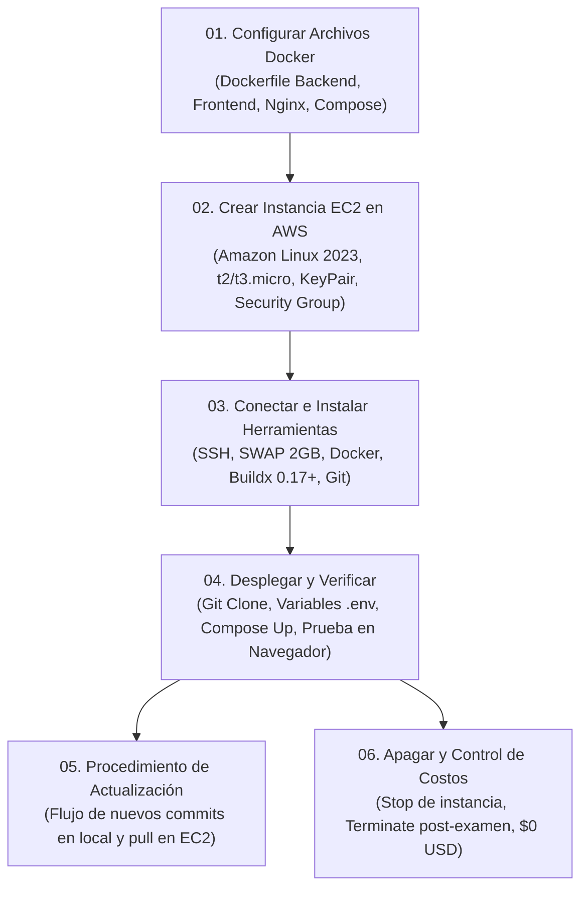

# Despliegue en AWS EC2 (Amazon Linux 2023) con Docker — Resumen General

Bienvenido a la guía integral y modular de despliegue en la nube para el proyecto **Diagramador de Clases UML Colaborativo en Tiempo Real**.

Esta documentación ha sido diseñada específicamente para desplegar la arquitectura completa del sistema en una única instancia **AWS EC2** con **Amazon Linux 2023**, haciendo uso de **Docker** y **Docker Compose** bajo un esquema de costo cero (apto para capa gratuita de AWS) y configurado para acceso directo mediante **IP Pública**.

---

## 🏛️ Arquitectura del Despliegue

El sistema se compone de cuatro contenedores aislados y orquestados en una red privada interna, protegidos por un Reverse Proxy Nginx que expone únicamente el puerto HTTP estándar:

```
                     PETICIONES EXTERNAS (Navegador Web)
                                      │
                                      ▼ [Puerto 80: HTTP]
                   ┌───────────────────────────────────────┐
                   │       REVERSE PROXY (Nginx)           │
                   │   Enrutador central de tráfico web    │
                   └──────────────────┬────────────────────┘
                                      │
              ┌───────────────────────┴───────────────────────┐
              │                                               │
      Ruta: / (Páginas Web)                      Rutas: /api y /ws (REST & WebSockets)
              │                                               │
              ▼                                               ▼
┌───────────────────────────┐                   ┌───────────────────────────┐
│     FRONTEND (Next.js)    │                   │   BACKEND (Spring Boot)   │
│  React 19 / TypeScript    │                   │   Java 17 / STOMP WS      │
│  Puerto interno: 3000     │                   │   Puerto interno: 8080    │
└───────────────────────────┘                   └─────────────┬─────────────┘
                                                              │
                                                     Conexión JPA/JDBC (5432)
                                                              │
                                                              ▼
                                                ┌───────────────────────────┐
                                                │   BASE DE DATOS (Postgres)│
                                                │    PostgreSQL 16 Alpine   │
                                                │  Volumen: postgres_data   │
                                                └───────────────────────────┘
```

---

## 🚀 Flujo General del Despliegue Paso a Paso



---

## 📚 Índice Modular de la Suite de Documentación

| Archivo | Objetivo y Contenido Técnico Principal |
| :--- | :--- |
| **[01_CONFIGURAR_PROYECTO.md](./01_CONFIGURAR_PROYECTO.md)** | Archivos `Dockerfile` multi-stage optimizados (Next.js y Spring Boot), configuración `nginx.conf` con soporte WebSocket y orquestador `docker-compose.yml`. |
| **[02_CREAR_INSTANCIA_AWS.md](./02_CREAR_INSTANCIA_AWS.md)** | Guía visual exacta de la consola de AWS EC2: selección de AMI Amazon Linux 2023, tipo de instancia, par de claves `.pem`, reglas de Security Group (puertos 22 y 80) y almacenamiento EBS. |
| **[03_INSTALAR_HERRAMIENTAS.md](./03_INSTALAR_HERRAMIENTAS.md)** | Conexión SSH con PowerShell/Bash, configuración obligatoria de 2 GB de memoria SWAP (para evitar Out-Of-Memory), instalación de Docker, Git y parche manual de Docker Buildx en AL2023. |
| **[04_DESPLEGAR_Y_VERIFICAR.md](./04_DESPLEGAR_Y_VERIFICAR.md)** | Clonación del repositorio en la instancia, variables de entorno para producción, construcción de contenedores con `docker compose up -d --build`, verificación de logs y pruebas de acceso vía IP pública. |
| **[05_ACTUALIZAR_PRODUCCION.md](./05_ACTUALIZAR_PRODUCCION.md)** | Procedimiento estricto de actualización ante nuevos cambios o correcciones en el código (commit/push en PC local y pull/rebuild en EC2 con limpieza de imágenes huérfanas). |
| **[06_APAGAR_SERVICIOS.md](./06_APAGAR_SERVICIOS.md)** | Gestión financiera y prevención de cobros: cómo pausar la instancia temporalmente (Stop) o destruirla tras el examen universitario (Terminate) para asegurar facturación $0 USD. |

---

> **Comenzar con el despliegue:** [01_CONFIGURAR_PROYECTO.md](./01_CONFIGURAR_PROYECTO.md)
